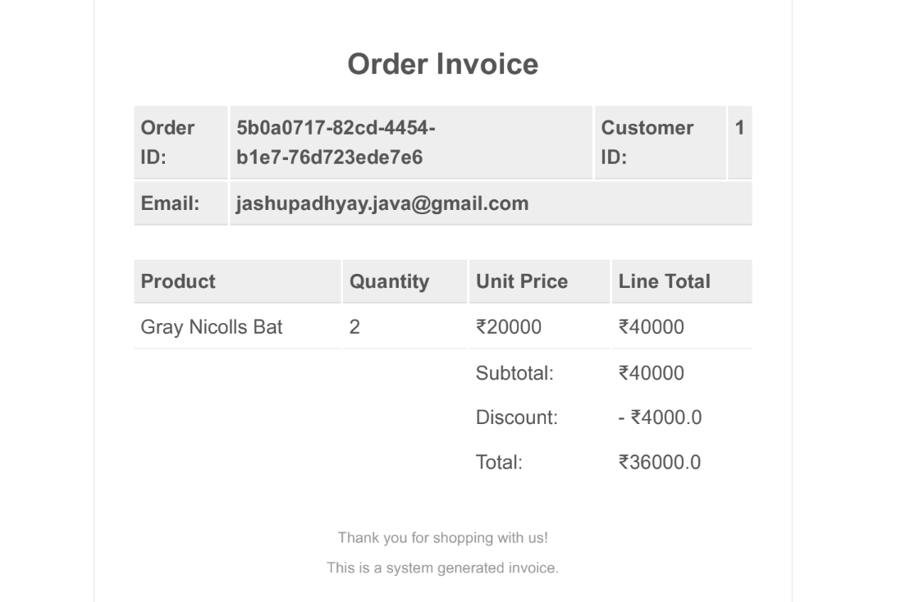

# 🛒 Cart Scope Backend

A full-featured Django REST Framework backend for an e-commerce platform.  
Includes **user management**, **seller and product management**, **product images**, **reviews**, **orders**, **coupon codes**, PDF **invoice generation**, and **email notifications**.

---

## 📂 Project Structure

```

ecomm/
│
├── ecomm/            # Project settings & URLs
├── user/             # User app for registration, login, deletion
├── app/              # Core e-commerce models, views, serializers, permissions
├── media/            # Uploaded files (product images, invoices)
├── db.sqlite3        # Default SQLite database
├── .env              # Environment variables
├── manage.py
└── requirements.txt  # Python dependencies

```

---

## ⚙️ Environment Variables

Create a `.env` file in the root directory:

```

DSK=<YOUR_DJANGO_SECRET_KEY>
EMAIL_USER=<YOUR_EMAIL_ADDRESS>
EMAIL_PASS=<YOUR_EMAIL_APP_PASSWORD>

````

- `DSK`: Django secret key  
- `EMAIL_USER`: Email to send invoices from  
- `EMAIL_PASS`: App password for your email account

---

## 🚀 Setup Instructions

1️⃣ **Clone the repository**

```bash
git clone https://github.com/bitsbuild/cart-scope-backend.git
cd ecomm
````

2️⃣ **Create a virtual environment**

```bash
python -m venv env
source env/bin/activate  # On Windows: env\Scripts\activate
```

3️⃣ **Install dependencies**

```bash
pip install -r requirements.txt
```

4️⃣ **Run migrations**

```bash
python manage.py makemigrations
python manage.py migrate
```

5️⃣ **Create a superuser**

```bash
python manage.py createsuperuser
```

6️⃣ **Run the server**

```bash
python manage.py runserver
```

Visit `http://127.0.0.1:8000/admin` to access the admin panel.

---

## 🌍 Project-Level URLs

| URL       | Description                                  |
| --------- | -------------------------------------------- |
| `/admin/` | Django admin site                            |
| `/user/`  | Endpoints for user creation, login, deletion |
| `/api/`   | Core e-commerce API endpoints                |

---

## 🧩 App-Level Endpoints

Below is a detailed breakdown of all major endpoints.

---

## ✅ **User App Endpoints**

| Method   | URL               | Description                        |
| -------- | ----------------- | ---------------------------------- |
| `POST`   | `/user/create/`   | Register a new user                |
| `POST`   | `/user/gettoken/` | Obtain auth token                  |
| `DELETE` | `/user/delete/`   | Delete user account (custom logic) |

**Usage example (register):**

```http
POST /user/create/
Content-Type: application/json

{
  "username": "johndoe",
  "password": "strongpassword",
  "email": "john@example.com"
}
```

**Usage example (get token):**

```http
POST /user/gettoken/
Content-Type: application/json

{
  "username": "johndoe",
  "password": "strongpassword"
}
```

---

## 🏪 **Seller Endpoints**

| Method | URL             | Description                 |
| ------ | --------------- | --------------------------- |
| CRUD   | `/api/sellers/` | Manage sellers (Admin only) |

Supports:

* Filter, search, ordering by fields: `id`, `name`, `about`, `postal_code`, `location`, `is_premium_seller`, `rating`

Example:

```http
GET /api/sellers/?search=Electronics
```

---

## 📂 **Product Category Endpoints**

| Method | URL                | Description                            |
| ------ | ------------------ | -------------------------------------- |
| CRUD   | `/api/categories/` | Manage product categories (Admin only) |

---

## 🛍️ **Product Endpoints**

| Method | URL              | Description                  |
| ------ | ---------------- | ---------------------------- |
| CRUD   | `/api/products/` | Manage products (Admin only) |

* Related images & reviews are nested.
* Supports filter/search/order by fields: `id`, `name`, `about`, `category`, `seller`, `quantity`, `price`, `rating`.

---

## 🖼️ **Product Images Endpoints**

| Method | URL                    | Description                                   |
| ------ | ---------------------- | --------------------------------------------- |
| CRUD   | `/api/product-images/` | Upload and manage product images (Admin only) |

---

## ⭐ **Review Endpoints**

| Method | URL             | Description                        |
| ------ | --------------- | ---------------------------------- |
| CRUD   | `/api/reviews/` | Users can add 1 review per product |

* Only authenticated users.
* Unique `(user, product)` pair enforced.
* Posting a review updates the product’s average rating automatically.

Example:

```http
POST /api/reviews/
Authorization: Token <user_token>

{
  "product": "<product_id>",
  "title": "Great quality",
  "body": "Very satisfied with this product.",
  "stars": 5
}
```

---

## 🎟️ **Coupon Code Endpoints**

| Method | URL             | Description                      |
| ------ | --------------- | -------------------------------- |
| CRUD   | `/api/coupons/` | Manage coupon codes (Admin only) |

---

## 📦 **Order Endpoints**

| Method | URL            | Description                          |
| ------ | -------------- | ------------------------------------ |
| POST   | `/api/orders/` | Place an order (Authenticated users) |
| GET    | `/api/orders/` | Admin/superuser can view all orders  |

✅ **Placing an order:**

* Pass: `customer`, `coupon_code`, and `order_items` (list).
* Generates PDF invoice and emails it automatically.

Example request:

```http
POST /api/orders/
Authorization: Token <user_token>

{
  "customer": 1,
  "coupon_code": "SUMMER10",
  "order_items": [
    {
      "product": "<product_id>",
      "quantity": 2
    },
    {
      "product": "<product_id>",
      "quantity": 1
    }
  ]
}
```

Response:

```json
{
  "Status": "Ordered Place Successfully!"
}
```

---

## ⚡ API Features

* 📃 **Filter**, 🔍 **Search**, 🔢 **Ordering**
* 📑 **Pagination**: 25 per page
* 🕒 **Throttle**: 60 requests per minute per user
* 🔒 **Auth**: Token-based authentication (`rest_framework.authtoken`)

---

## 🧩 Project-Level Routing Summary

```
/admin/                    - Django admin site
/user/                     - User management endpoints
/api/sellers/              - Seller CRUD
/api/categories/           - Product Category CRUD
/api/products/             - Product CRUD
/api/product-images/       - Product Images CRUD
/api/reviews/              - Product Reviews CRUD
/api/orders/               - Place/View Orders
/api/coupons/              - Manage Coupons
/api/order-items/          - Manage Order Items
```

---

## 🏷️ Tech Stack

* Python 3.x
* Django 4.x
* Django REST Framework
* SQLite (development)
* WeasyPrint (PDF invoices)
* Gmail SMTP (order email)

---

## Highlight Feature

On Placing A Order An Invoice Is Stored To The Order Instance, And The Invoice Is Also Mailed To The User


